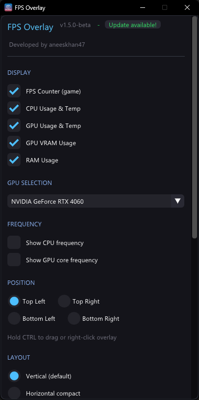
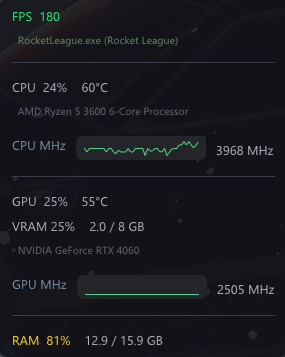
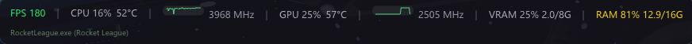
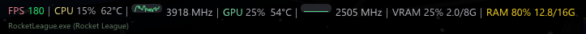

# FPS Overlay - Lightweight Game Performance Monitor - Anti-cheat safe

A lightweight, no-bloat FPS overlay for Windows. Just stats on your screen while gaming — nothing else.

   

> ⭐ If you like FPS Overlay, please leave a star. It supports the project and keeps it growing. Thank you! ⭐

---

> [!WARNING]
> **⚠️ Beta Software:** This project is currently in beta and under active development. Features, UI, and behavior are subject to change. Feedback and bug reports are welcome!

> [!Important]
> <details>
> <summary>Read Important Information Regarding Antivirus's False Positives</summary> 
>
> #### This happens relatively frequently with specialized system tools for some key reasons:
>
> - **LibHardwareMonitor**: The FPS Overlay makes use of the [LibHardwareMonitor](https://github.com/LibreHardwaRemonitor/LibreHardwareMonitor) library to pull hardware information like your CPU temperature and GPU usage on the fly. Since this library deals directly with hardware drivers and low level system APIs heuristic based scanners such as VirusTotal often flag this as "suspicious" or "malicious behavior" since it mimics the way certain malicious software interacts with the internal system.
> - **Overlay Injection**: Since the application needs to draw an overlay ontop of your currently open windows, such as your games, certain AV scanners misinterpret this as "code injection" which is what is often flagged by AI driven security vendors.
> - **Unsigned Binaries:** The source for the application is open-source and as the executable itself is currently unsigned with a very expensive commercial certificate, a number of smaller, more sensitive AV engines are quick to "flag it as high confidence" risk since the publisher is "unknown".
>
> The easiest way for you to verify this is to examine the source code for yourself:
>
> All the code is open source here on github repo, here you can verify how the data is handled, and here you can see how its interface with the LibHardwareMonitor library. In the worst case scenario and even if you are worried, you can even build the application yourself directly on your machine.
> </details>

> [!CAUTION]
> #### Fullscreen display modes are not supported\*
> Games require **Borderless**/**Borderless Windowed**/**Borderless Fullscreen** mode to be enabled via in-game display settings in order for the FPS Overlay to show above the game window.
>
> FPS Overlay will only work in **windowed fullscreen mode** and **windowed borderless fullscreen mode**, but will not work in true **fullscreen mode** or **exclusive fullscreen mode**. True **fullscreen mode** and **exclusive fullscreen mode** on desktop means that other computer applications cannot be displayed over the application that’s in **fullscreen mode** and **exclusive fullscreen mode**.

---

## Features

- **FPS** — Real in-game framerate via Windows **ETW** (DirectX 9–12, OpenGL, Vulkan)
- **CPU** — Usage, temperature, and optional **CPU clock (MHz)** with a minimal sparkline; pick the LHWM clock sensor in settings
- **GPU** — Usage and temperature (NVIDIA, AMD, Intel via **LibreHardwareMonitor**)
- **GPU core clock** — Optional **core frequency (MHz)** with a minimal sparkline; pick the clock sensor for the **selected GPU**
- **Multi-GPU** — Detect all discrete GPUs and choose which one to monitor
- **VRAM** — Memory usage (percent and used / total GB)
- **RAM** — System memory usage (percent and used / total GB)
- **Three layouts** — **Vertical** stack, **horizontal** compact one-liner, or a **Steam-style** bar
- **Temperature units** — Celsius or Fahrenheit
- **Process label** — Shows which process is used for the FPS / game name line
- **Position & opacity** — Corners or drag-to-place; opacity for the overlay
- **Persistent settings** — Saved next to the executable (`config.ini`)
- **Fully click-through** — Does not steal mouse focus from games
- **Custom hotkeys** — Toggle visibility and exit (default: **Insert** and **End**)
- **System tray** — Minimized when running in the background
- **CTRL + drag / CTRL + right-click menu** — Move the overlay or open hide / settings / exit without affecting other apps
- **Lightweight** — No installer, no background services, no bloat, ~9 MB portable folder

## Screenshots

| Settings | Vertical layout |
|:---:|:---:|
|  |  |

| Horizontal compact | Steam-like layout |
|:---:|:---:|
|  |  |

## Why I Built This

I wanted a simple FPS overlay. That's it. Just FPS, CPU, GPU, RAM stats on my screen while gaming. Somehow this turned into a mass-uninstall session when I realized every existing solution came with baggage:

### What I tried and why I gave up:

| Tool | Why I Ditched It |
|------|------------------|
| **Xbox Game Bar** | Uninstalled it ages ago for performance reasons, now Windows won't let me reinstall it. Classic. |
| **NVIDIA GeForce Experience / Shadowplay / NVIDIA App** | I just want an FPS counter, not a 500MB "gaming platform" that wants to optimize my games, record everything, and run 3 background services. |
| **MSI Afterburner** | Powerful, yes. But I don't need overclocking tools, fan curves, voltage controls, and hardware monitoring graphs. I just want to see my FPS. |
| **NZXT CAM** | Came with my AIO, immediately became system tray bloatware that phones home and wants to "enhance my gaming experience." |
| **Steam Overlay** | Would be fine if more than 5% of my library was on Steam. |
| **Overwolf** | Still not sure what this actually does besides slow everything down and show ads. |
| **RivaTuner** | The OG, respect. But it's 2026 and I still don't need 90% of what it offers. |
| **Fraps** | Last updated in 2013. Enough said. |

### So I built my own:

- **~9MB total** — Single .exe plus bundled DLLs, no installer, no background services
- **C++ with DirectX 11 + Dear ImGui** — As lightweight as it gets
- **No account required. No telemetry. No "gaming optimization" features. No social integration. No ads. Just stats.**

## Download

Grab the latest release from the [Releases](../../releases) page.

Or build it yourself (see below).

## Usage

1. Run the *overlay.exe* (Administrator required)
   1. It will prompt you to install PawnIO if it's not already installed or update it if it's outdated.
   2. You must restart your computer after the installation or updating PawnIO for FPS Overlay to work.   
> [!NOTE]
> PawnIO is a driver that is required for LibreHardwareMonitor to work which FPS Overlay rely on to get CPU and GPU stats. It is also used by the popular tools like OpenRGB. You can learn more about PawnIO [here](https://pawnio.eu/).
2. Select which stats you want to display
3. Choose your position, layout, and hotkeys
4. Click **Start Overlay**
5. Game on!

### Controls

| Action | How |
|--------|-----|
| Move overlay | Hover over overlay + hold **CTRL** + drag |
| Right-click menu | Hover over overlay + hold **CTRL** + right-click |
| Toggle visibility | Your configured hotkey (default: **Insert**) |
| Exit | Your configured hotkey (default: **End**) |

> **Note:** The overlay only responds to CTRL when your mouse is hovering over it, so it won't interfere with CTRL shortcuts in other applications.

## Why ETW? Why Admin?

There are basically 3 ways to get real game FPS:

| Method | How it works | Downsides |
|--------|--------------|-----------|
| **DLL Injection** (RivaTuner/Afterburner) | Hooks directly into the game's graphics calls | Can trigger anti-cheat bans or crash games |
| **Vendor Hooks** (NVIDIA/AMD overlays) | Built into their drivers | Comes with hundreds of MB of bloatware and background services |
| **ETW** (Windows Event Tracing) | Kernel-level Windows API that fires events when any process presents a frame | Requires admin privileges |

I went with **ETW** because:

- **Anti-cheat safe** — Doesn't touch game processes at all
- **Universal** — Works with DirectX 9/10/11/12, OpenGL, and Vulkan games
- **No injection** — Nothing gets loaded into the game

The tradeoff is that ETW requires admin because it's a system-wide kernel tracing API. Windows won't let unprivileged apps listen to cross-process events for security reasons. Same reason PresentMon and CapFrameX need admin — it's a Windows security requirement, not a design choice.

### Graphics API Compatibility

| Graphics API | Supported |
|--------------|-----------|
| DirectX 12 | ✅ Yes |
| DirectX 11 | ✅ Yes |
| DirectX 10/10.1 | ✅ Yes |
| DirectX 9 | ✅ Yes (via D3D9 ETW provider) |
| OpenGL | ✅ Yes (via DxgKrnl ETW provider) |
| Vulkan | ✅ Yes (via DxgKrnl ETW provider) |

## Building from Source

### Requirements

- Windows 10/11
- Visual Studio 2022+ Build Tools (with C++ workload)

### Build

```bash
git clone https://github.com/aneeskhan47/fps-overlay.git
cd fps-overlay
build-msvc.bat
```

The output is `build\overlay\overlay.exe` along with required DLLs.

### Dependencies (included)

- [Dear ImGui](https://github.com/ocornut/imgui) — Immediate mode GUI
- [LibreHardwareMonitor](https://github.com/LibreHardwareMonitor/LibreHardwareMonitor) — Cross-vendor hardware monitoring
- [lhwm-cpp-wrapper](https://gitlab.com/OpenRGBDevelopers/lhwm-wrapper) — C++ wrapper for LibreHardwareMonitor
- DirectX 11 SDK (Windows SDK)

## Project Structure

```
fps-overlay/
├── src/
│   ├── main.cpp        # All application code
│   └── resource.rc     # Windows resources (icon, version info)
├── libs/
│   ├── imgui/          # Dear ImGui library
│   └── lhwm/           # LibreHardwareMonitor wrapper
├── build/              # Build output
│   ├── overlay/        # Release binaries (from build-msvc.bat)
│   │   ├── overlay.exe
│   │   ├── lhwm-wrapper.dll
│   │   └── LibreHardwareMonitorLib.dll
│   └── config.ini      # Settings (created on first run, next to overlay.exe)
├── icon.ico            # Application icon
├── build-msvc.bat      # Build script
├── FPSOverlay.vcxproj  # Visual Studio project
└── README.md
```

## Tech Stack

- **Language:** C++20
- **Build:** MSVC (Visual Studio Build Tools)
- **Graphics:** DirectX 11
- **UI:** Dear ImGui
- **FPS Tracking:** Windows ETW (Event Tracing for Windows) with D3D9, DXGI, and DxgKrnl providers
- **CPU Stats:** LibreHardwareMonitor 
- **GPU Stats:** LibreHardwareMonitor (supports NVIDIA, AMD, Intel)
- **Windowing:** Win32 API (layered transparent window)

## Like this project?

 Please consider leaving a tip on Ko-Fi :)

 <p align="center"><a href='https://ko-fi.com/aneeskhan47' target='_blank'></a></p>
  
*No bloat. No telemetry. Just stats.*
